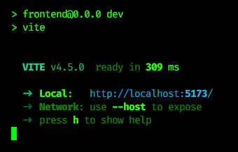

# Web Quiz 3: on Task Management System

## How to run:
Step 1 : Go to the frontend and backend part to use the command
`npm install` 
Step 2 : Go to the backend and run command `npm start` 
Step 3 : Go to the frontend and run command `npm run dev` 
Step 4 : Performing step 3 will give the link and port number for the react website so just click the link and go to the page

## Features: 
1. Login and signup (Both User and Admin)
2. Create a task with priority, category and due date.
3. Search & Filter for task by name or category
4. Mark tasks as done
5. Delete old tasks
6. Sort tasks based on priority and due date
7. View task details and descriptions by clicking on them